# Вестников Роман - Лабораторные работы

## 1 работа

Движение происходит путём последовательного изменения координат центра телеги и постоянного отрисовывания траектории на *background* изображении. На каждый отдельный кадр также попискельно отрисовывется сама телега и выводится на экран.
___

## 1 работа - 2 доп

Есть 2 класса - физичексий объект и поле фона. 

Физ. объект имеет массу, координаты, скорость и ускорение.  Их мы можем вручную задать на этапе инициализации.

На каждом шаге их пространственные параметры меняются в соответсвии с формулой притяжения от двух других объектов. В результате все три объекта приходят в движение. 

Поле фона представляет собой чёрный фон и отрисованные траектории движений всех объектов, а также сами объекты. На каждом шаге наносится новое положение объектов и дополняется траектория движения.
___

## 2 работа

Каждое задание выполняется в отдельных закомментированных блоках.

Исходное изображение для экспериментов:

  
      

___

**п.1** - Результат собственного box фильтра:

  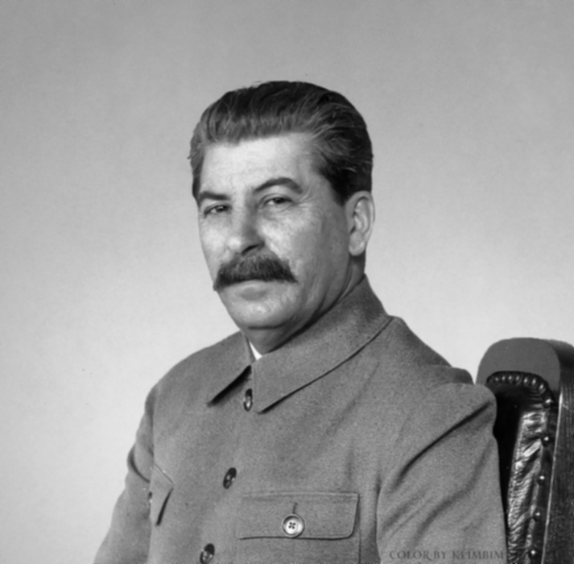
      

___

**п.2** - Точность собственного box фильтра по сравнению с исходным: 99.5394%
___

**п.3** - Время собственного box фильтра: 0.060513с, время исходного: 0.0003171с

Разница (есть только по краям):

  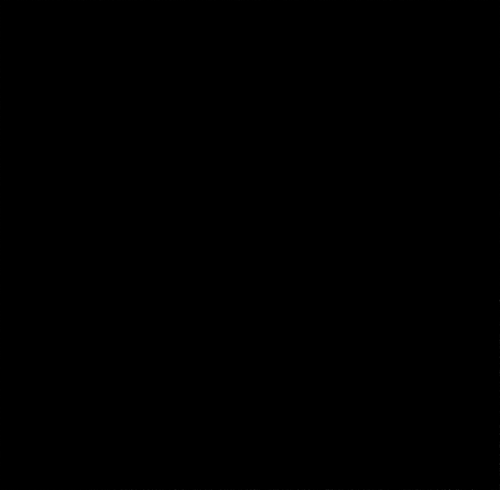
      

___

**п.4** - Разница между gauss и box фильтрами (логарифмированная):

  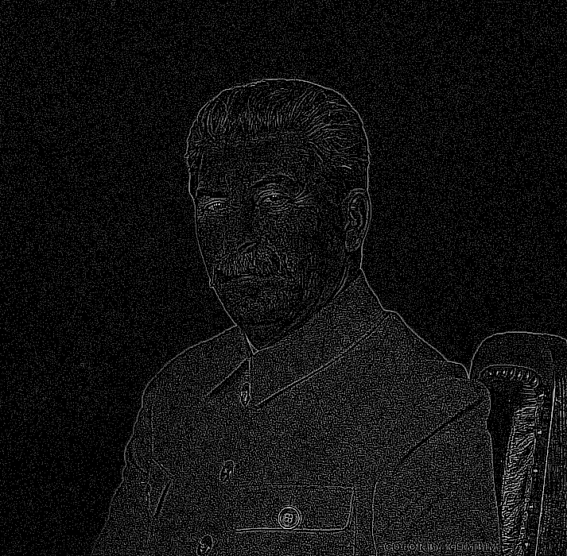
      

Видно, что края и шумы стали выраженны лучше, за счёт того, что Гаусс с большим коэффициентом выделяет центральные  пискели.

___

**п.5** - Разница между box и gauss фильтрации для unsharp mask (логарифмированная):

  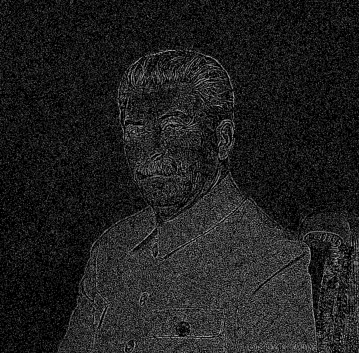
      

Тут Гаусс так же выделил больше шумов и границ, за счёт чего они стали более ярко выражены.

___

**п.6** - Результат собственного фильтра Лапласа:

  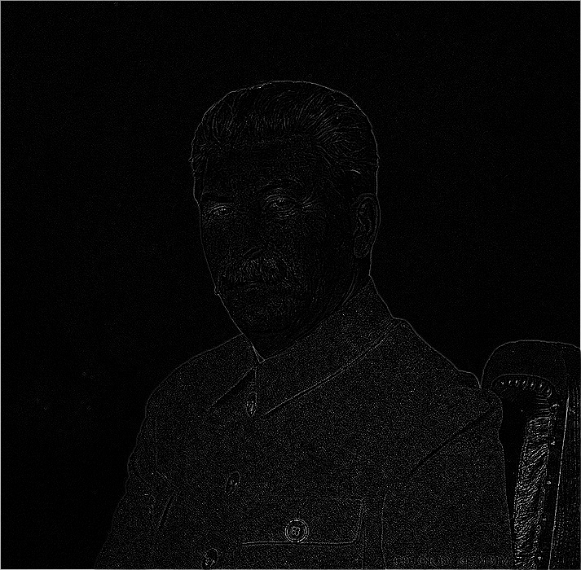
      

Фильтр выделяет границы и шумы. При сложении исходного изображения с отфильтрованным, чёткость будет повышена.

___

**п.7** - Разница между gauss и laplas фильтрации для unsharp mask (логарифмированная):

  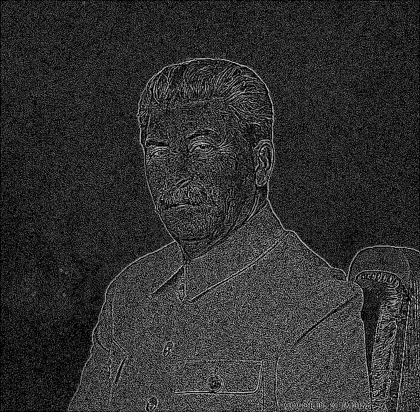
      

Гаусс значительно сильнее реагирует на шумы, за счёт чего их концентрация увеличена по сравнению с Лапласом. 

___

## 3 работа

**п.1** - Сперва происходит бинаризация изображения, затем поиск контуров и их моментов. По моментам находится центр масс и обозначается чёрной точкой на исх. изображении.
Результаты:

  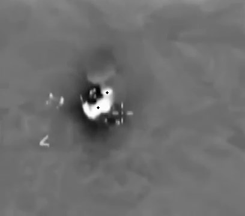
      

  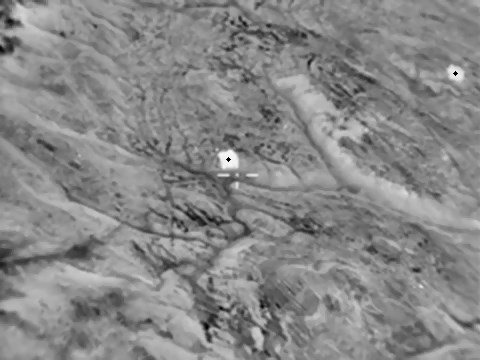
      

  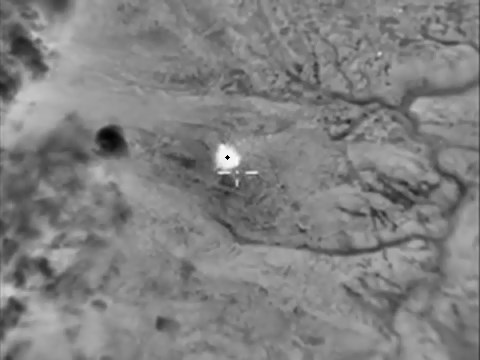
      

___

**п.2** - Изображение преобразуется в HSV формат и далее происходит его бинаризация по красно-жёлтому оттенку. 
Результаты:

  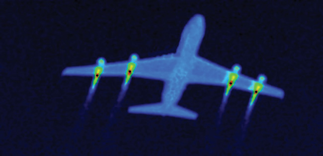
      

  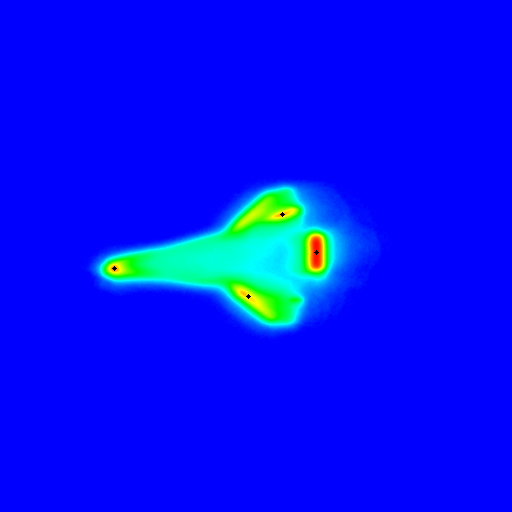
      

  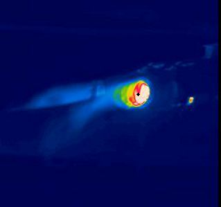
      

  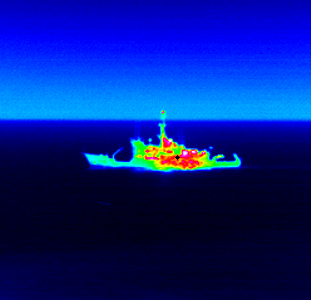
      

  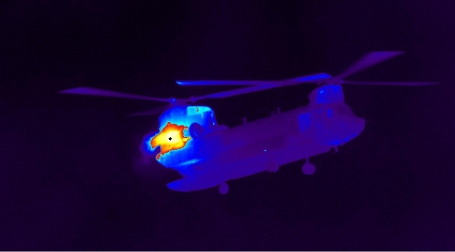
      

___

**п.3** - Предварительно изображение проходит через медианный фильтр и преобразуется в HSV формат. Далее происходит поиск положения лампочики по яркому бело-жёлтому оттенку. Затем по некоторым размерам лампочка из изображения вырезается (заполняется чёрным). Затем отдельно ищутся синие, красные и зелёные крышки на изображении по оттенкам (см. п.2) и их контура выделяются соотв. цветом. Затем анализируются все контура, путём поиска их центров масс через моменты (см. п.1). Ближайшие к лампе центры масс выделяются на исх. изображении.
Результаты:

  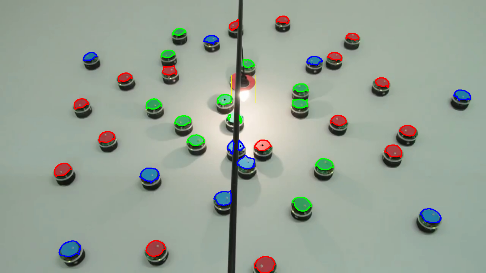
      

  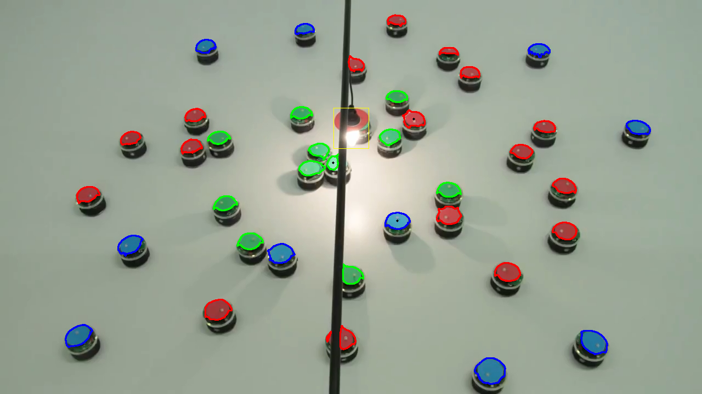
      

___

**п.4** - Предварительно изображение проходит через медианный фильтр и преобразуется в HSV формат. Далее происходит поиск по шаблону необходимых объектов на основе всех найденных контуров. Все контура сравниваются с шаблонным и фильтруются по метрике сравнения. Результат:

  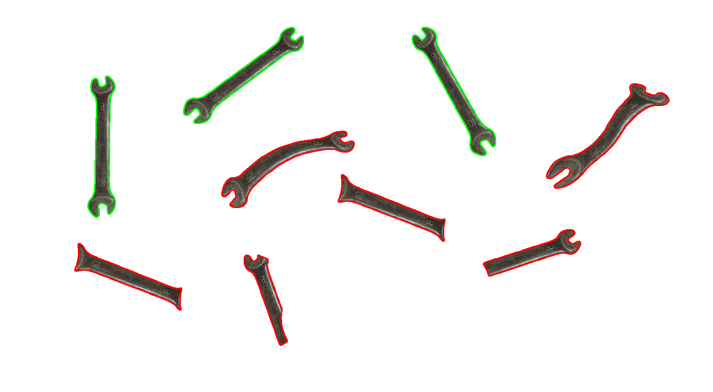
      

P.S. Поиск всех параметров для бинарной сегментации производился при помощи реализации TrackBar функции встроенными методами OpenCV. Двигая ползунки менялось изображение, на основе чего можно было качественно выделять необходимые цветовые промежутки.